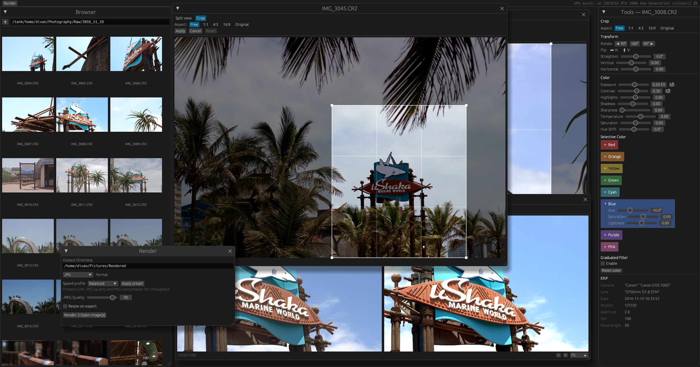

# Photograph


Native Rust desktop photo browser/editor for image management and color grading.

Photograph focuses on practical desktop workflows: browsing folders, opening images, applying non-destructive edits, and exporting rendered files.

## Status

Active project (MVP is usable and still evolving).

Current support intent: Ubuntu Linux.

## Screenshot



## What It Does Today

- Folder browser with thumbnail grid
- Full image viewer/editor windows (egui/eframe)
- EXIF metadata display
- Non-destructive edits stored as sidecar JSON (`<image>.json`)
- Geometry edits: rotate, flip, crop, straighten, keystone
- Color/tone edits: exposure, white balance, HSL, selective color, graduated filter, highlight/shadow recovery
- Export rendered images as `JPG`, `PNG`, or `WebP` with quality/compression and optional resize
- Background rendering/export progress UI

## Supported Formats

- RAW decode via `rawler`: `RAF`, `DNG`, `NEF`, `CR2`, `ARW`
- Standard image formats via `image` crate fast path (for example `JPG`, `PNG`, `TIFF`, `WebP`, `BMP`)
- The browser also recognizes `HEIC` and `AVIF` extensions, but actual decode support depends on the image stack available in the current build

## Quick Start

```bash
cargo run --bin photograph
```

The app opens a native window and remembers UI state/config between runs.

## Ubuntu/Debian Dependencies

For local runs and debugging, install Vulkan user-space tools and verify adapter visibility:

```bash
sudo apt update
sudo apt install -y vulkan-tools
vulkaninfo --summary
```

If `vulkaninfo` cannot detect your discrete adapter, fix driver/runtime setup before running Photograph.

For `.deb` packaging from the `Makefile`:

```bash
sudo apt install -y dpkg-dev
```

## Development

Build, run, and test:

```bash
cargo build
cargo run --bin photograph
cargo test
```

Live-reload dev loop (requires `cargo-watch`):

```bash
cargo install cargo-watch
make dev
```

## Configuration

Photograph stores config at:

- Linux: `~/.config/photograph/config.toml`

Current persisted settings include window sizes/positions, last browsed path, and preview backend preference.

Example:

```toml
browse_path = "/path/to/photos"
preview_backend = "auto" # auto | gpu | gpu_pipeline | cpu (debug only)
```

You can also override preview backend at runtime:

```bash
PHOTOGRAPH_PREVIEW_BACKEND=gpu_pipeline cargo run --bin photograph
```

CPU fallback is debug-only and requires:

```bash
PHOTOGRAPH_DEBUG_ALLOW_CPU_FALLBACK=1 PHOTOGRAPH_PREVIEW_BACKEND=cpu cargo run --bin photograph
```

## Packaging

The `Makefile` supports Linux (`.deb`) packaging.

Photograph is currently intended to be supported on Ubuntu Linux.

Icon assets are derived from the SVG source at `packaging/linux/photograph.svg`:

```bash
make icons
```

This regenerates the embedded runtime PNG (`assets/photograph-icon-128.png`).
Normal `make build` does not regenerate icon assets.

Common targets:

```bash
make build          # Linux packaging build
make install        # Linux package install
make build-linux    # build .deb on Linux
```

Linux packaging assets live under `packaging/linux/`.

## Performance Probe

There is a CLI benchmark helper for raw preview/export throughput:

```bash
cargo run --bin perf_probe -- /path/to/raws [count] [auto|cpu|gpu_pipeline]
```

`cpu` mode in `perf_probe` also requires `PHOTOGRAPH_DEBUG_ALLOW_CPU_FALLBACK=1`.

It prints `METRIC ...` lines for preview latency and export throughput.

## Architecture Docs

Pipeline and architecture decisions are documented in `/docs`:

- [Pipeline Architecture](docs/pipeline-architecture.md)
- [Pipeline Decisions (ADR-style)](docs/pipeline-decisions.md)
- [RAW Load Latency Notes](docs/raw-load-latency.md)

These docs include Mermaid diagrams (flowcharts and sequence diagrams) for preview processing, export processing, and backend policy enforcement.

## Project Layout

- `src/` application code (`browser`, `viewer`, `editor`, processing pipeline)
- `src/bin/perf_probe.rs` benchmark helper
- `docs/` architecture notes and design decisions
- `assets/` embedded app assets (including icon)
- `packaging/` Linux packaging files
- `Makefile` dev/build/install/package commands

## License

GPL-2.0-only. See `LICENSE`.
