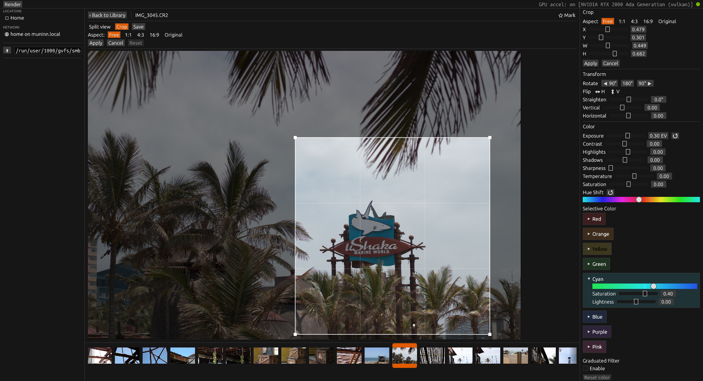

# Photograph

[](#ubuntu-debian-dependencies)


Native Rust desktop photo browser/editor for image management and color grading.

Photograph focuses on practical desktop workflows: browsing folders, opening images, applying non-destructive edits, and exporting rendered files.

## Status

Active project (MVP is usable and still evolving).

Current support intent: Ubuntu Linux only (see [ADR-0012](docs/adr/0012-drop-macos-support-linux-only.md)).

## Screenshot



## What It Does Today

- Folder browser with thumbnail grid; sidebar lists mounted drives, ZFS pools, and network shares (NFS/SMB/sshfs/GVfs)
- Full image viewer/editor windows (egui/eframe)
- EXIF metadata display
- Non-destructive edits stored as sidecar JSON (`<image>.json`)
- Geometry edits: rotate, flip, crop, straighten, keystone
- Color/tone edits: exposure, white balance, HSL, selective color, graduated filter, highlight/shadow recovery
- Export rendered images as `JPG`, `PNG`, or `WebP` with quality/compression and optional resize
- Background rendering/export progress UI

## Supported Formats

- RAW decode via `rawler`: `RAF`, `DNG`, `NEF`, `CR2`, `CR3`, `ARW`
- Standard image formats via `image` crate fast path (for example `JPG`, `PNG`, `TIFF`, `WebP`, `BMP`)
- The browser also recognizes `HEIC` and `AVIF` extensions, but actual decode support depends on the image stack available in the current build

## Install

### Linux (.deb)

Download the latest `.deb` and install it with apt:

```bash
wget -O photograph_amd64.deb https://github.com/divanvisagie/Photograph/releases/latest/download/photograph_amd64.deb
sudo apt install ./photograph_amd64.deb
```

Older versions and release notes are on [GitHub Releases](https://github.com/divanvisagie/Photograph/releases).

**Upgrading:** the same two commands upgrade an existing install. Don't upgrade by opening the
`.deb` in Ubuntu's App Center: when any version is already installed it shows a greyed-out
"Installed" and won't upgrade ([app-center#2190](https://github.com/ubuntu/app-center/issues/2190)).

Or build and install the `.deb` locally via the `Makefile` (see [Packaging](#packaging)):

```bash
sudo apt install -y dpkg-dev
make install
```

Photograph is not distributed as a Snap: strict confinement can't give a photo browser access to
arbitrary locations like `/tank` or other custom mounts (see
[ADR-0016](docs/adr/0016-drop-snap-packaging.md)).

### From Source

```bash
cargo run --bin photograph
```

The app opens a native window and remembers UI state/config between runs.

## Ubuntu/Debian Dependencies

For local runs and debugging, install Vulkan user-space tools and verify adapter visibility:

```bash
sudo apt update
sudo apt install -y vulkan-tools
vulkaninfo --summary
```

If `vulkaninfo` cannot detect a Vulkan GPU adapter, fix driver/runtime setup before running Photograph.

For `.deb` packaging from the `Makefile`:

```bash
sudo apt install -y dpkg-dev
```

## Development

Build, run, and test:

```bash
cargo build
cargo run --bin photograph
cargo test
```

Live-reload dev loop (requires `cargo-watch`):

```bash
cargo install cargo-watch
make dev
```

## Configuration

Photograph stores config at `~/.config/photograph/config.toml`.

Current persisted settings include window sizes/positions, last browsed path, and preview backend preference.

Example:

```toml
browse_path = "/path/to/photos"
preview_backend = "auto" # auto | gpu | gpu_pipeline | cpu (debug only)
```

You can also override preview backend at runtime:

```bash
PHOTOGRAPH_PREVIEW_BACKEND=gpu_pipeline cargo run --bin photograph
```

CPU fallback is debug-only and requires:

```bash
PHOTOGRAPH_DEBUG_ALLOW_CPU_FALLBACK=1 PHOTOGRAPH_PREVIEW_BACKEND=cpu cargo run --bin photograph
```

## Packaging

The `Makefile` builds a `.deb`. `make build` builds it (`make build-deb`); `make install` builds and
installs it (`make install-linux`, aliased from `make install`).

Icon assets are derived from the SVG source at `packaging/linux/photograph.svg`:

```bash
make icons
```

This regenerates the embedded runtime PNG (`assets/photograph-icon-128.png`).

Common targets:

```bash
make                # list all targets
make build          # build the .deb
make build-deb      # build the .deb
make install        # build and install the .deb
make release        # tag and publish a GitHub release with the .deb (see Releasing)
```

### Releasing

Releases are cut from `master` only. The tag and the `.deb` version both come from `version` in
`Cargo.toml`.

1. Bump the version, then merge to `master` and push:

   ```bash
   make bump V=0.1.4   # updates Cargo.toml, Cargo.lock and the site download link, then commits
   ```

2. On `master`, with the bump pushed:

   ```bash
   make release
   ```

`make release` first runs `make release-check`. The check fails if you're not on `master`, if the
working tree has uncommitted changes, if `HEAD` isn't the same as `origin/master`, or if the version
is already tagged. `make release` then builds the `.deb`, creates an annotated `v<version>` tag on
`HEAD`, pushes the tag, and publishes the GitHub release with `--verify-tag`. This way the release
points at the exact commit the `.deb` was built from. It needs the `gh` CLI, logged in.

Each release gets two copies of the `.deb`: the versioned one, and an unversioned
`photograph_amd64.deb` at a stable "latest" URL.

- **Landing page** (`docs/index.html`): the download button and its `wget` line link the
  *versioned* file, so each version downloads under its own name. `make bump` rewrites those links
  to the new version, and `make release-check` refuses to release if they don't match.
- **Terminal instructions:** they use the stable URL with `wget -O`, so a re-download overwrites
  the old file instead of being saved beside it.

Linux packaging assets live under `packaging/linux/`.

## Performance Probe

There is a CLI benchmark helper for raw preview/export throughput:

```bash
cargo run --bin perf_probe -- /path/to/raws [count] [auto|cpu|gpu_pipeline]
```

`cpu` mode in `perf_probe` also requires `PHOTOGRAPH_DEBUG_ALLOW_CPU_FALLBACK=1`.

It prints `METRIC ...` lines for preview latency and export throughput.

## Architecture Docs

Pipeline and architecture decisions are documented in `/docs`:

- [Pipeline Architecture](docs/pipeline-architecture.md)
- [Architecture Decision Records](docs/adr/README.md)
- [RAW Load Latency Notes](docs/raw-load-latency.md)

These docs include Mermaid diagrams (flowcharts and sequence diagrams) for preview processing, export processing, and backend policy enforcement.

## Project Layout

- `src/` application code (`browser`, `viewer`, `editor`, processing pipeline)
- `src/bin/perf_probe.rs` benchmark helper
- `docs/` architecture notes and design decisions
- `assets/` embedded app assets (including icon)
- `packaging/` Linux packaging files
- `Makefile` dev/build/install/package commands

## License

GPL-2.0-only. See `LICENSE`.
