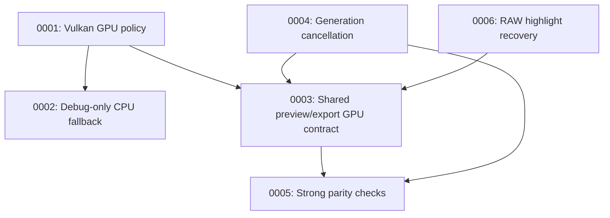

# Architecture Decision Records

This directory records high-impact architecture decisions for the Photograph image
pipeline, following Michael Nygard's ADR convention as summarized by Martin Fowler:
https://martinfowler.com/bliki/ArchitectureDecisionRecord.html

Each decision is one file, numbered sequentially and never rewritten once accepted —
superseded decisions get a new record instead. See [`docs/ADR.md`](../ADR.md) for the
full process and template, or `.claude/skills/adr/SKILL.md` for the Claude Code skill
that automates it.

## Index

| ID | Decision | Status |
| --- | --- | --- |
| [0001](0001-require-vulkan-gpu.md) | Require Vulkan GPU (prefer discrete, allow integrated) for normal runtime | Accepted |
| [0002](0002-cpu-fallback-debug-only.md) | Allow CPU fallback only with explicit debug env flag | Accepted |
| [0003](0003-shared-preview-export-backend.md) | Use one GPU pipeline for both preview and export | Accepted |
| [0004](0004-preview-cancellation.md) | Keep async preview generation/cancellation semantics | Accepted |
| [0005](0005-guard-parity-tests.md) | Use parity tests with guarded fill-skip behavior | Accepted |
| [0006](0006-raw-highlight-recovery.md) | Apply highlight recovery during RAW develop, before sRGB gamma | Accepted |

## Decision Relationship

## Revisit Triggers

- Hardware target changes from Vulkan-focused Linux profile to broader cross-platform
  release goals.
- GPU texture-size limits materially impact export workflows.
- Future `wgpu`/driver changes require backend policy adjustments.
