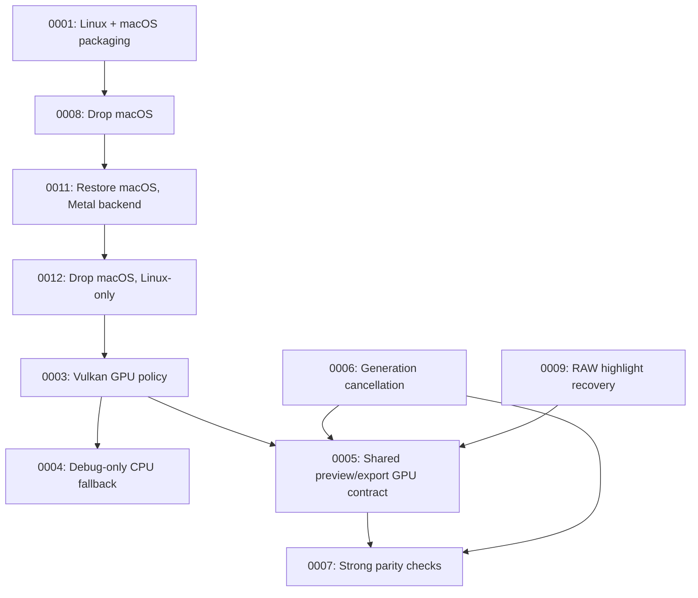

# Architecture Decision Records

This directory holds ADRs for Photograph — short records of significant architecture decisions,
written at the time they're made, following Michael Nygard's format as popularized by Martin
Fowler: <https://martinfowler.com/bliki/ArchitectureDecisionRecord.html>.

## When to write one

Write an ADR when a decision is:

- Hard, or expensive, to reverse once other code depends on it.
- Not obvious from reading the code — a "why", not a "what".
- The kind of thing that'll get re-litigated later without a record ("didn't we already decide
  this?").

Small, reversible choices don't need one. Rule of thumb: if you'd want to explain the choice to a
new contributor in a paragraph beyond what the code itself shows, it's ADR-sized.

An ADR is a point-in-time record of *a decision as it was made*, including the options considered
and rejected. It does not get rewritten later — a decision that reverses or replaces an earlier one
gets its own new ADR that supersedes the old one, which stays in place with its status updated.

## Convention

- One file per decision: `NNNN-short-kebab-title.md`, numbered sequentially, zero-padded to 4
  digits. Numbers are never reused, even for a decision that gets reversed.
- Start from [`0000-template.md`](0000-template.md) — copy it, don't write from scratch.
- `Status` is one of: `Proposed`, `Accepted`, `Rejected`, `Deprecated`, or `Superseded by
  ADR-NNNN` (linked to the superseding record).
- Every new ADR gets a row in the index below.
- Keep records short — a paragraph or two per section is normal. An ADR documents a decision and
  its reasoning, not a design document.

If you're working with Claude Code in this repo, `.claude/skills/adr/SKILL.md` automates the
mechanics of adding one.

## Index

| # | Title | Status |
|---|-------|--------|
| [0001](0001-platform-packaging-linux-and-macos.md) | Support Linux and macOS via platform-specific packaging | Superseded by [ADR-0008](0008-drop-macos-packaging.md) |
| [0002](0002-edit-state-sidecar-persistence.md) | Persist edit state via per-image JSON sidecar files | Accepted |
| [0003](0003-require-vulkan-gpu.md) | Require Vulkan GPU (prefer discrete, allow integrated) for normal runtime | Accepted |
| [0004](0004-cpu-fallback-debug-only.md) | Allow CPU fallback only with explicit debug env flag | Accepted |
| [0005](0005-shared-preview-export-backend.md) | Use one GPU pipeline for both preview and export | Accepted |
| [0006](0006-preview-cancellation.md) | Keep async preview generation/cancellation semantics | Accepted |
| [0007](0007-guard-parity-tests.md) | Use parity tests with guarded fill-skip behavior | Accepted |
| [0008](0008-drop-macos-packaging.md) | Drop macOS packaging, ship Linux .deb only | Superseded by [ADR-0011](0011-restore-macos-metal-backend.md) |
| [0009](0009-raw-highlight-recovery.md) | Apply highlight recovery during RAW develop, before sRGB gamma | Accepted |
| [0010](0010-snap-packaging-vulkan-gpu-2404.md) | Package for Linux via snap, using the gpu-2404 content interface for Vulkan | Accepted |
| [0011](0011-restore-macos-metal-backend.md) | Restore macOS support via a Metal GPU backend | Superseded by [ADR-0012](0012-drop-macos-support-linux-only.md) |
| [0012](0012-drop-macos-support-linux-only.md) | Drop macOS support; Photograph is Linux-only | Accepted |

## Decision Relationship

## Revisit Triggers

- GPU texture-size limits materially impact export workflows.
- Future `wgpu`/driver changes require backend policy adjustments.
- Renewed macOS demand that native alternatives (Photos, third-party RAW editors) don't cover —
  see ADR-0012 for what it would actually cost to support again.
