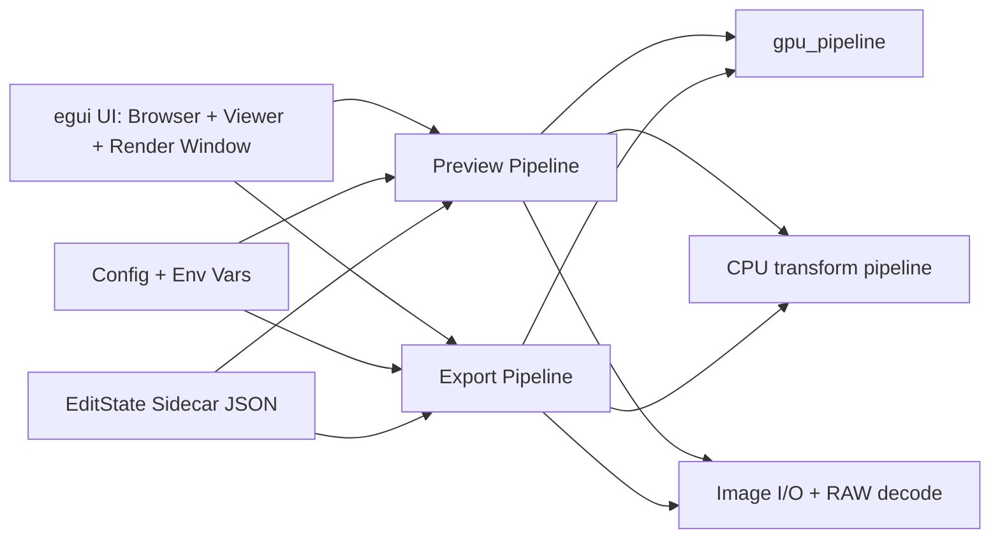
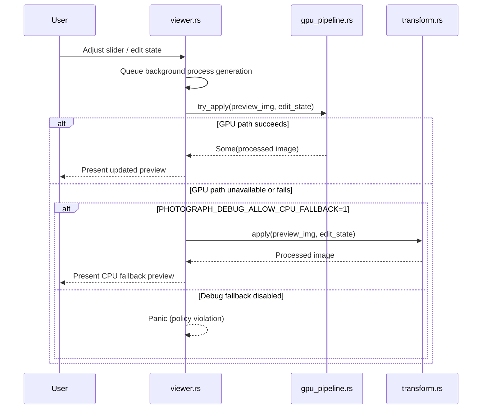
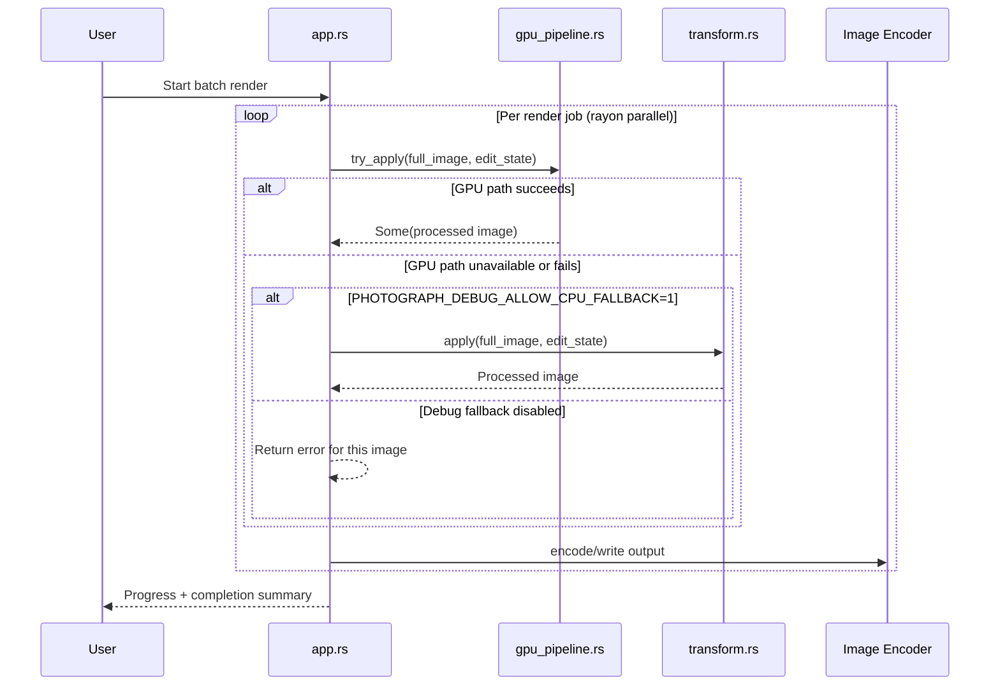
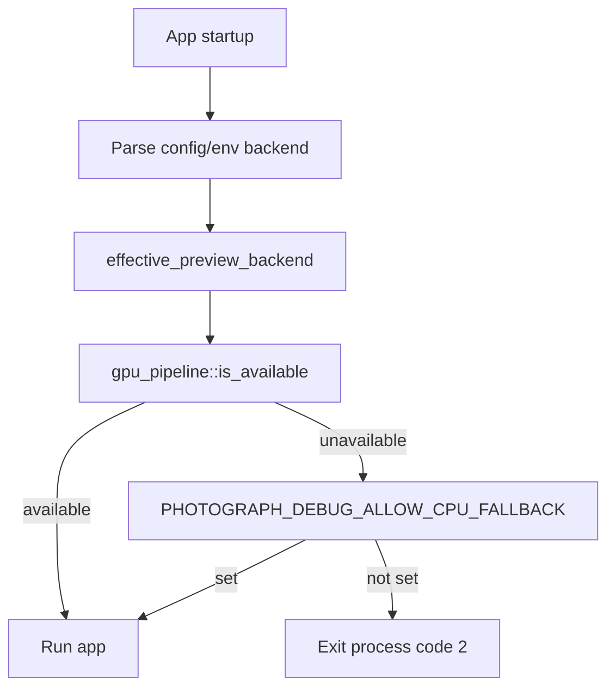

# Photograph Pipeline Architecture

This document explains the current preview/export pipeline architecture and how the GPU policy is enforced.

## Scope

- Preview processing path (`Viewer`)
- Export/render processing path (`PhotographApp`)
- GPU backend selection and runtime policy
- Data flow between sidecar edit state and image processing

## Component Map

## Preview Processing Sequence

Key files:

- `src/viewer.rs`
- `src/processing/gpu_pipeline.rs`
- `src/processing/transform.rs`

## Export Processing Sequence

Key files:

- `src/app.rs`
- `src/processing/gpu_pipeline.rs`
- `src/processing/transform.rs`

## Backend Policy and Startup

Key file:

- `src/main.rs`

## Notes on Current Limits

- GPU init is intentionally strict: Vulkan backend + discrete GPU.
- CPU fallback exists only for debug operation and controlled troubleshooting.
- Very large images can exceed GPU texture limits; tiled GPU export is the next architectural step to keep large exports fully GPU-native.
