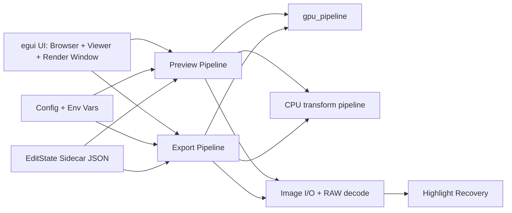
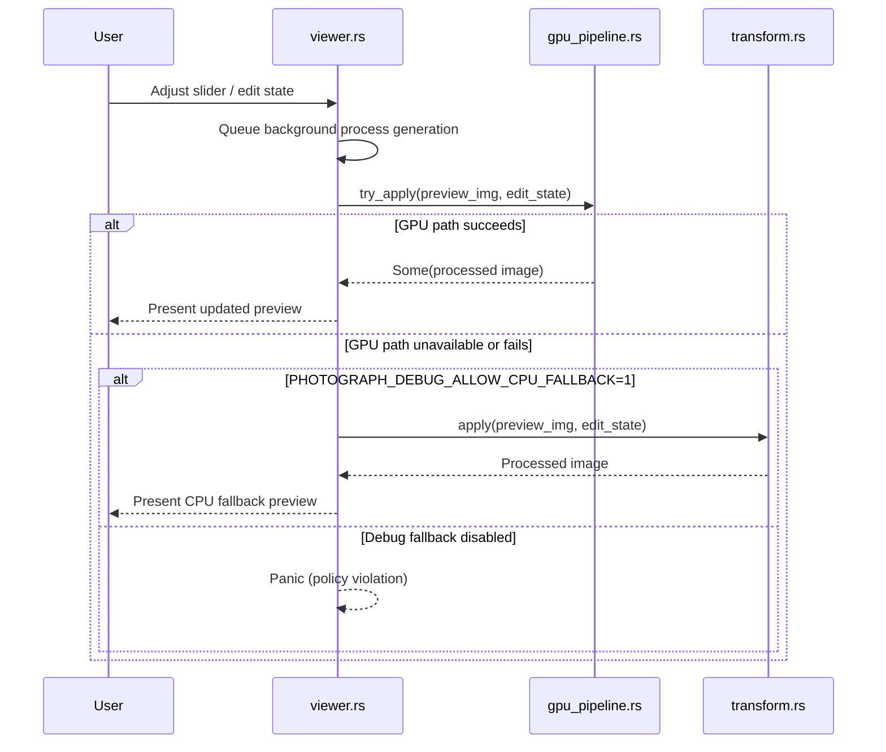
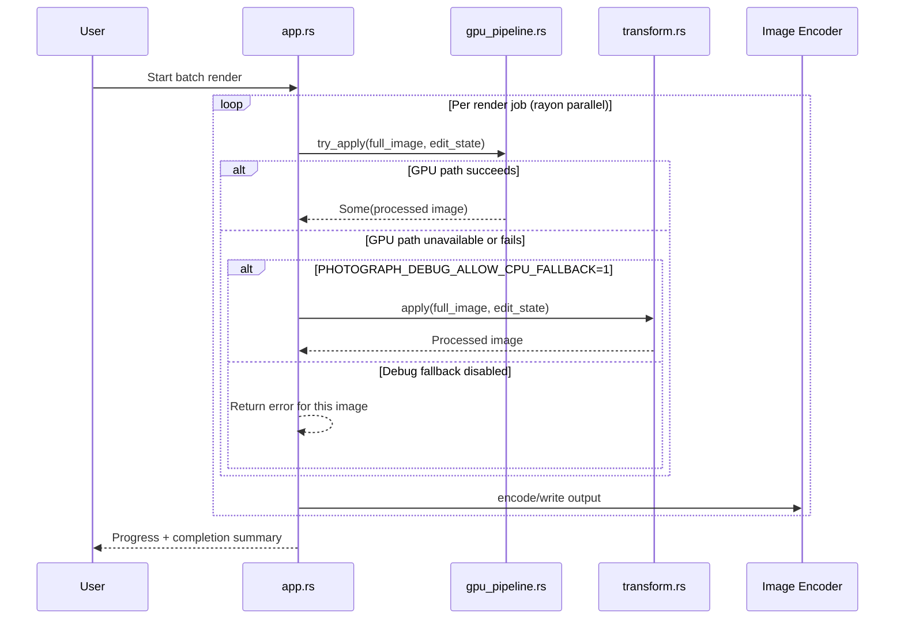
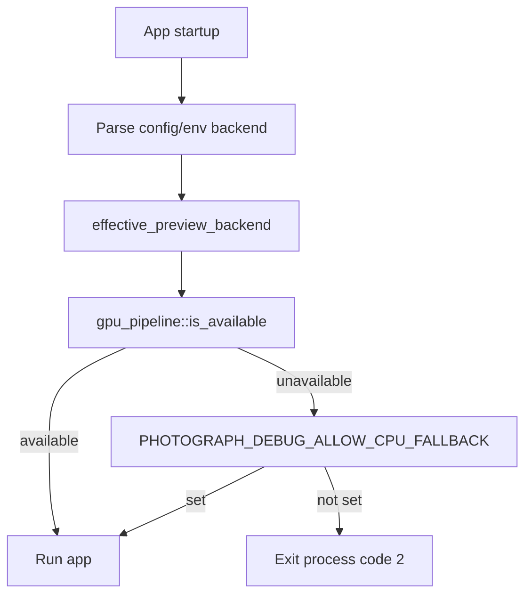
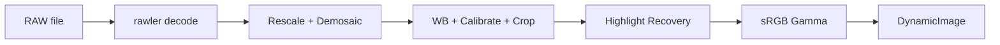

# Photograph Pipeline Architecture

This document explains the current preview/export pipeline architecture and how the GPU policy is enforced.

## Scope

- Preview processing path (`Viewer`)
- Export/render processing path (`PhotographApp`)
- GPU backend selection and runtime policy
- Data flow between sidecar edit state and image processing

## Component Map

```mermaid
flowchart LR
    UI[egui UI: Browser + Viewer + Render Window]
    CONFIG[Config + Env Vars]
    EDITS[EditState Sidecar JSON]
    PREVIEW[Preview Pipeline]
    EXPORT[Export Pipeline]
    GPU[gpu_pipeline]
    CPU[CPU transform pipeline]
    IO[Image I/O + RAW decode]
    HR[Highlight Recovery]

    UI --> PREVIEW
    UI --> EXPORT
    CONFIG --> PREVIEW
    CONFIG --> EXPORT
    EDITS --> PREVIEW
    EDITS --> EXPORT
    PREVIEW --> GPU
    PREVIEW --> CPU
    EXPORT --> GPU
    EXPORT --> CPU
    PREVIEW --> IO
    EXPORT --> IO
    IO --> HR
```

## Preview Processing Sequence

```mermaid
sequenceDiagram
    participant User
    participant Viewer as viewer.rs
    participant GP as gpu_pipeline.rs
    participant CPU as transform.rs

    User->>Viewer: Adjust slider / edit state
    Viewer->>Viewer: Queue background process generation
    Viewer->>GP: try_apply(preview_img, edit_state)
    alt GPU path succeeds
        GP-->>Viewer: Some(processed image)
        Viewer-->>User: Present updated preview
    else GPU path unavailable or fails
        alt PHOTOGRAPH_DEBUG_ALLOW_CPU_FALLBACK=1
            Viewer->>CPU: apply(preview_img, edit_state)
            CPU-->>Viewer: Processed image
            Viewer-->>User: Present CPU fallback preview
        else Debug fallback disabled
            Viewer-->>Viewer: Panic (policy violation)
        end
    end
```

Key files:

- `src/viewer.rs`
- `src/processing/gpu_pipeline.rs`
- `src/processing/transform.rs`

## Export Processing Sequence

```mermaid
sequenceDiagram
    participant User
    participant App as app.rs
    participant GP as gpu_pipeline.rs
    participant CPU as transform.rs
    participant Enc as Image Encoder

    User->>App: Start batch render
    loop Per render job (rayon parallel)
        App->>GP: try_apply(full_image, edit_state)
        alt GPU path succeeds
            GP-->>App: Some(processed image)
        else GPU path unavailable or fails
            alt PHOTOGRAPH_DEBUG_ALLOW_CPU_FALLBACK=1
                App->>CPU: apply(full_image, edit_state)
                CPU-->>App: Processed image
            else Debug fallback disabled
                App-->>App: Return error for this image
            end
        end
        App->>Enc: encode/write output
    end
    App-->>User: Progress + completion summary
```

Key files:

- `src/app.rs`
- `src/processing/gpu_pipeline.rs`
- `src/processing/transform.rs`

## Backend Policy and Startup

```mermaid
flowchart TD
    START[App startup]
    PARSE[Parse config/env backend]
    EFFECTIVE[effective_preview_backend]
    GPUCHECK[gpu_pipeline::is_available]
    DEBUGFLAG[PHOTOGRAPH_DEBUG_ALLOW_CPU_FALLBACK]
    EXIT[Exit process code 2]
    RUN[Run app]

    START --> PARSE --> EFFECTIVE --> GPUCHECK
    GPUCHECK -->|available| RUN
    GPUCHECK -->|unavailable| DEBUGFLAG
    DEBUGFLAG -->|set| RUN
    DEBUGFLAG -->|not set| EXIT
```

Key file:

- `src/main.rs`

## RAW Develop and Highlight Recovery

RAW files are developed using a custom `rawler::RawDevelop` pipeline that omits the sRGB gamma step. This allows highlight recovery to operate on linear f32 pixel data before tonal compression.

```mermaid
flowchart LR
    RAW[RAW file]
    DECODE[rawler decode]
    RESCALE[Rescale + Demosaic]
    CALIB[WB + Calibrate + Crop]
    HR[Highlight Recovery]
    SRGB[sRGB Gamma]
    IMG[DynamicImage]

    RAW --> DECODE --> RESCALE --> CALIB --> HR --> SRGB --> IMG
```

The highlight recovery pass (`src/processing/highlights.rs`) runs two operations:

1. **Channel reconstruction** — For pixels where 1 or 2 channels are clipped (≥ 0.99) but at least one is not, the clipped channels are replaced with the average of the unclipped channel(s). This restores color gradation in overexposed regions.
2. **Soft-knee compression** — An exponential curve maps values above 0.85 smoothly toward 1.0, preventing hard clipping artifacts.

Both preview (Stage B full decode via `open_image`) and export use the same develop function (`develop_raw_with_recovery` in `thumbnail.rs`), maintaining parity per ADR-003.

Key files:

- `src/thumbnail.rs` (`develop_raw_with_recovery`)
- `src/processing/highlights.rs`

## Notes on Current Limits

- GPU init is intentionally strict: Vulkan backend + non-CPU adapter (discrete preferred).
- CPU fallback exists only for debug operation and controlled troubleshooting.
- Very large images can exceed GPU texture limits; tiled GPU export is the next architectural step to keep large exports fully GPU-native.
