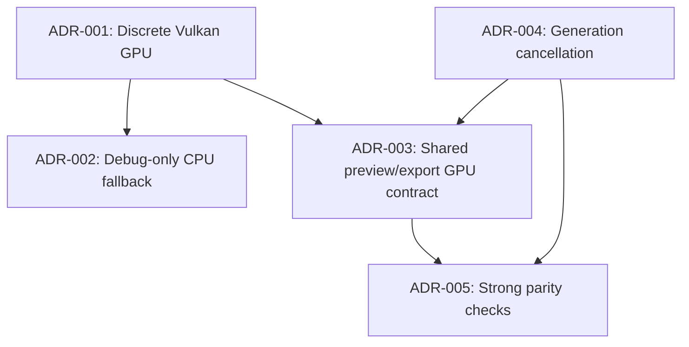

# Photograph Pipeline Decisions

This page records high-impact architecture decisions for the image pipeline using [Architecture Decision Records (ADR)](https://adr.github.io/).

## Decision Index

| ID | Decision | Status |
| --- | --- | --- |
| ADR-001 | Require discrete Vulkan GPU for normal runtime | Accepted |
| ADR-002 | Allow CPU fallback only with explicit debug env flag | Accepted |
| ADR-003 | Use one GPU pipeline for both preview and export | Accepted |
| ADR-004 | Keep async preview generation/cancellation semantics | Accepted |
| ADR-005 | Use parity tests with guarded fill-skip behavior | Accepted |

## ADR-001: Require Discrete Vulkan GPU

- Context: The project is optimized for a known Linux desktop profile with discrete graphics.
- Decision: Initialize [`wgpu`](https://wgpu.rs/) with Vulkan-only backend and reject non-discrete adapters.
- Why: Reduces variability and allows optimization against one hardware class.
- Implementation: `src/processing/gpu_pipeline.rs` (`init_gpu_context`).

## ADR-002: CPU Fallback Is Debug-Only

- Context: Silent runtime fallback to CPU hides performance regressions and policy violations.
- Decision: CPU fallback is disabled by default and only enabled via `PHOTOGRAPH_DEBUG_ALLOW_CPU_FALLBACK=1`.
- Why: Keeps performance expectations deterministic in normal operation.
- Implementation:
  - `src/processing/gpu_pipeline.rs` (`DEBUG_ALLOW_CPU_FALLBACK_ENV`, `allow_debug_cpu_fallback`)
  - `src/main.rs` (startup enforcement)
  - `src/viewer.rs` and `src/app.rs` (preview/export behavior)

## ADR-003: One Processing Backend Contract for Preview and Export

- Context: Divergent preview/export backends increase parity bugs and maintenance cost.
- Decision: Both preview and export attempt `gpu_pipeline::try_apply` first and follow the same fallback policy.
- Why: One contract improves predictability and testing leverage.
- Implementation:
  - Preview: `src/viewer.rs`
  - Export: `src/app.rs`

## ADR-004: Preserve Generation-Based Preview Cancellation

- Context: Rapid UI updates can apply stale frames when background jobs complete out of order.
- Decision: Keep generation tokens and stale-result dropping in viewer background processing.
- Why: Ensures responsive editing without visual rollback artifacts.
- Implementation: `src/viewer.rs`.

## ADR-005: Guard Against False-Positive Parity Tests

- Context: Simple fill-pixel skipping can hide severe regressions (for example near-black outputs).
- Decision: Keep fill-aware comparisons, but bound the allowed skipped-fill ratio.
- Why: Maintains tolerance for boundary interpolation differences while still catching broken output.
- Implementation: `src/processing/gpu_pipeline.rs` test helpers.

## Decision Relationship

## Revisit Triggers

- Hardware target changes from single-profile Linux/discrete GPU to cross-platform release goals.
- GPU texture-size limits materially impact export workflows.
- Future `wgpu`/driver changes require backend policy adjustments.
