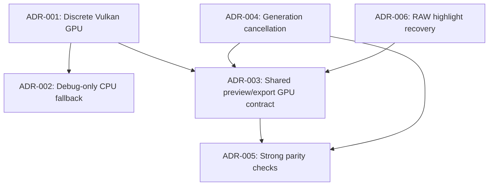

# Photograph Pipeline Decisions

This page records high-impact architecture decisions for the image pipeline using [Architecture Decision Records (ADR)](https://adr.github.io/).

## Decision Index

| ID | Decision | Status |
| --- | --- | --- |
| ADR-001 | Require discrete Vulkan GPU for normal runtime | Accepted |
| ADR-002 | Allow CPU fallback only with explicit debug env flag | Accepted |
| ADR-003 | Use one GPU pipeline for both preview and export | Accepted |
| ADR-004 | Keep async preview generation/cancellation semantics | Accepted |
| ADR-005 | Use parity tests with guarded fill-skip behavior | Accepted |
| ADR-006 | Apply highlight recovery during RAW develop, before sRGB gamma | Accepted |

## ADR-001: Require Discrete Vulkan GPU

- Context: The project is optimized for a known Linux desktop profile with discrete graphics.
- Decision: Initialize [`wgpu`](https://wgpu.rs/) with Vulkan-only backend and reject non-discrete adapters.
- Why: Reduces variability and allows optimization against one hardware class.
- Implementation: `src/processing/gpu_pipeline.rs` (`init_gpu_context`).

## ADR-002: CPU Fallback Is Debug-Only

- Context: Silent runtime fallback to CPU hides performance regressions and policy violations.
- Decision: CPU fallback is disabled by default and only enabled via `PHOTOGRAPH_DEBUG_ALLOW_CPU_FALLBACK=1`.
- Why: Keeps performance expectations deterministic in normal operation.
- Implementation:
  - `src/processing/gpu_pipeline.rs` (`DEBUG_ALLOW_CPU_FALLBACK_ENV`, `allow_debug_cpu_fallback`)
  - `src/main.rs` (startup enforcement)
  - `src/viewer.rs` and `src/app.rs` (preview/export behavior)

## ADR-003: One Processing Backend Contract for Preview and Export

- Context: Divergent preview/export backends increase parity bugs and maintenance cost.
- Decision: Both preview and export attempt `gpu_pipeline::try_apply` first and follow the same fallback policy.
- Why: One contract improves predictability and testing leverage.
- Implementation:
  - Preview: `src/viewer.rs`
  - Export: `src/app.rs`

## ADR-004: Preserve Generation-Based Preview Cancellation

- Context: Rapid UI updates can apply stale frames when background jobs complete out of order.
- Decision: Keep generation tokens and stale-result dropping in viewer background processing.
- Why: Ensures responsive editing without visual rollback artifacts.
- Implementation: `src/viewer.rs`.

## ADR-005: Guard Against False-Positive Parity Tests

- Context: Simple fill-pixel skipping can hide severe regressions (for example near-black outputs).
- Decision: Keep fill-aware comparisons, but bound the allowed skipped-fill ratio.
- Why: Maintains tolerance for boundary interpolation differences while still catching broken output.
- Implementation: `src/processing/gpu_pipeline.rs` test helpers.

## ADR-006: Apply Highlight Recovery During RAW Develop

- Context: The default `RawDevelop` pipeline applies sRGB gamma then converts to u16, clipping any channel values above 1.0 in linear space. In overexposed RAW regions where only some channels are sensor-saturated, the unclipped channels carry recoverable scene information that is lost by this clipping.
- Decision: Use a custom `RawDevelop` pipeline that omits the `SRgb` step, apply highlight reconstruction on the linear f32 intermediate data, then apply sRGB gamma before conversion to `DynamicImage`.
- Why: Operating on linear f32 data between calibration and gamma allows reconstruction of partially-clipped highlights. Clipped channels are replaced using brightness from unclipped channels, and a soft-knee compressor maps the extended range smoothly to [0, 1]. This produces visible improvement in highlight gradation without changing the downstream GPU/CPU processing pipeline.
- Algorithm: Two-pass over linear RGB pixels:
  1. **Channel reconstruction**: Pixels with 1 or 2 channels above clip threshold (0.99) have those channels replaced with the average of the remaining unclipped channel(s).
  2. **Soft-knee compression**: An exponential deceleration curve maps values above the knee point (0.85) smoothly into [0, 1].
- Implementation:
  - `src/processing/highlights.rs` (recovery algorithm)
  - `src/thumbnail.rs` (`develop_raw_with_recovery`)
- Consistency: Both preview (Stage B full decode) and export flow through `open_image()`, so recovery policy is shared automatically (per ADR-003).

## Decision Relationship

```mermaid
flowchart TD
    A[ADR-001: Discrete Vulkan GPU] --> B[ADR-002: Debug-only CPU fallback]
    A --> C[ADR-003: Shared preview/export GPU contract]
    C --> E[ADR-005: Strong parity checks]
    D[ADR-004: Generation cancellation] --> C
    D --> E
    F[ADR-006: RAW highlight recovery] --> C
```

## Revisit Triggers

- Hardware target changes from single-profile Linux/discrete GPU to cross-platform release goals.
- GPU texture-size limits materially impact export workflows.
- Future `wgpu`/driver changes require backend policy adjustments.
