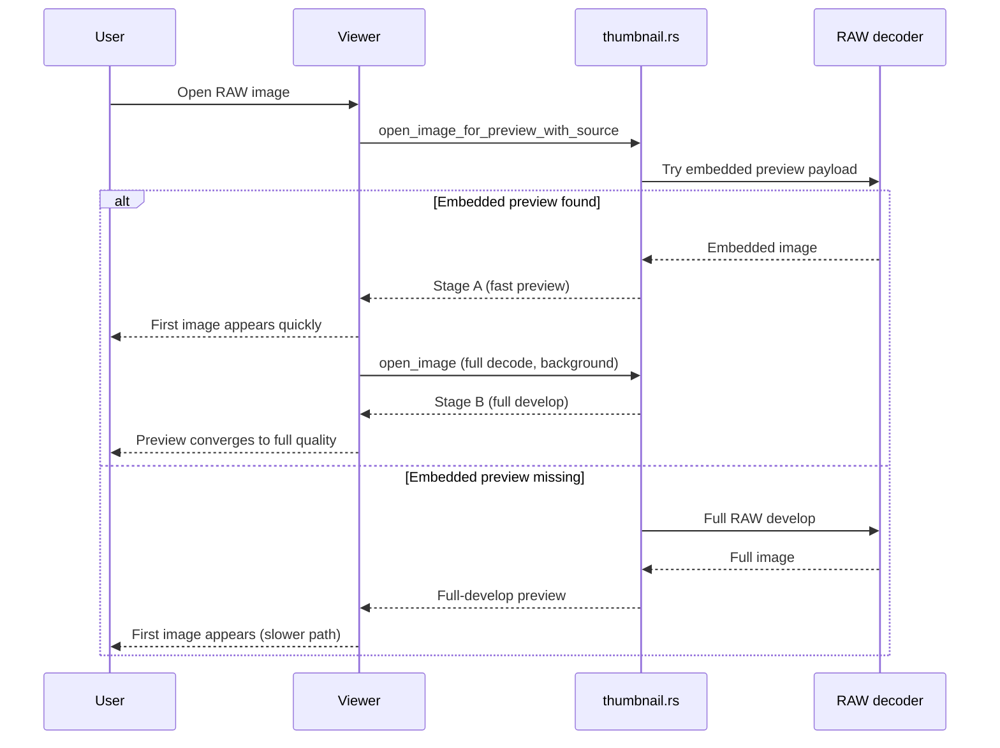

# RAW Load Latency Notes

This note documents the recent RAW-loading improvement where initial preview now appears significantly faster in typical workflows.

## What Changed

1. Preview decode path now prefers embedded RAW assets.
- `src/thumbnail.rs` now tries embedded preview/thumbnail/full payloads first for RAW files.
- Full RAW develop is used as fallback when embedded payloads are unavailable.

2. Viewer open now uses staged RAW loading.
- Stage A: show fast embedded preview first.
- Stage B: run background full RAW decode only when Stage A used embedded preview, then replace preview for quality convergence.

3. Browser thumbnails benefit automatically.
- Thumbnail cache misses call the preview path, so RAW-heavy folders get faster first thumbnail readiness.

## Why It Feels Faster

- Embedded RAW preview payloads are much cheaper than full RAW develop.
- The UI can show a useful first frame quickly, while full-fidelity image processing continues in the background.

## Relevant Files

- `src/thumbnail.rs`
- `src/viewer.rs`
- `src/browser.rs`

## Verification

Use the same fixed RAW dataset and compare before/after:

```bash
cargo run --release --bin perf_probe -- <raw-dir> 20 auto
```

Primary metrics to compare:

- `METRIC preview_ms_median`
- `METRIC slider_ms_median`

Latest 20-file host run on 2026-02-28 (`/tank/home/divan/Photography/Raw`, `auto` backend, no debug CPU fallback):

- Runtime: `gpu_pipeline availability: available, adapter=NVIDIA RTX 2000 Ada Generation (vulkan)`
- `METRIC preview_ms_median=20.49`
- `METRIC slider_ms_median=24.36`
- `METRIC export_wall_s=19.72`
- `METRIC export_images_per_sec=1.014`

If needed for debugging-only baseline comparisons:

```bash
PHOTOGRAPH_DEBUG_ALLOW_CPU_FALLBACK=1 cargo run --release --bin perf_probe -- <raw-dir> 20 cpu
```

## Load Flow


